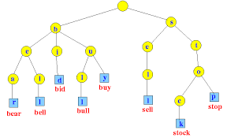

# Trie Text Search
This repository contains the code base for one of the projects of the Data Structures course at Ferdowsi University of Mashhad. The project's main objective is to demonstrate the application of Tries in searching for a specific word within a text document. We achieve this by converting a text document into Trie structures and then finding the exact occurrences of a user-specified word.

## Approach
The project is implemented using the following approach:

1. **Splitting the Input Text**: The input text is split into an array of words. Each word represents a distinct entity that we want to search for.

2. **Calculating Word Indices**: For each word in the input text, we calculate the index of all its occurrences. These indices will help us locate the exact positions of the word in the text.

3. **Creating a Map**: We create a map that associates words with an array list of their indices. This map is used to efficiently organize and access the occurrences of each word.

4. **Building an Empty Trie**: We initialize an empty Trie data structure. Tries are used to efficiently store and search for words in the text.

5. **Trie Node Structure**: In this implementation, the last character of each word in the Trie contains an array list of indices where that word occurs in the text.

6. **Inserting Words into Trie**: We insert all the words and their corresponding indices into the Trie. This allows us to efficiently search for words and retrieve their occurrences.

7. **Searching in Trie**: To find occurrences of a word, we use the contains method provided by the Trie data structure. This method quickly determines whether the word exists in the text and returns its indices.